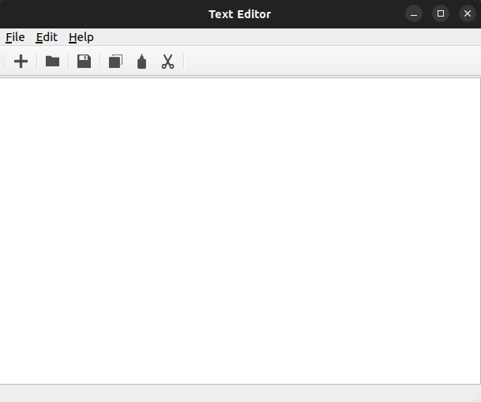
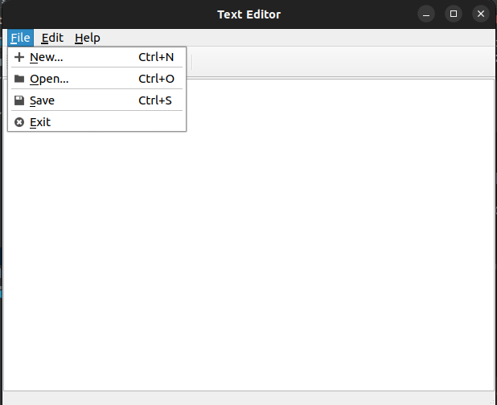
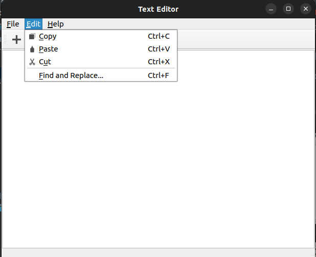

# Text editor


*Python MIPT 2023*

> Author
>> Lukashev Kirill

## Description

This project was written as part of the Python course at MIPT.

Functionality:
 - Ability to edit the file
 - Text search and replace
 - Hotkeys for coping, pasting, saving and exiting

## System requirements

> Python 3 \
> PyQt5

## Project build

#### *Сreate virtual environment*
```console
User@user-laptop:~$ pip install virtualenv
User@user-laptop:~$ virtualenv myvenv
User@user-laptop:~$ source myvenv\bin\activate
```
#### *Install requirements.txt*
```console
(myvenv)User@user-laptop:~$ pip install requirements.txt
```
#### *Run command*
```console
(myvenv)User@user-laptop:~$ python3 main.py
```

## GUI

 




## Hot Keys

> Ctrl+A - Select all \
> Ctrl+N - New file \
> Ctrl+O - Open file \
> Ctrl+S - Save file \
> Ctrl+C - Copy \
> Ctrl+V - Paste \
> Ctrl+X - Cut 
> Ctrl+F - Find and Replace
